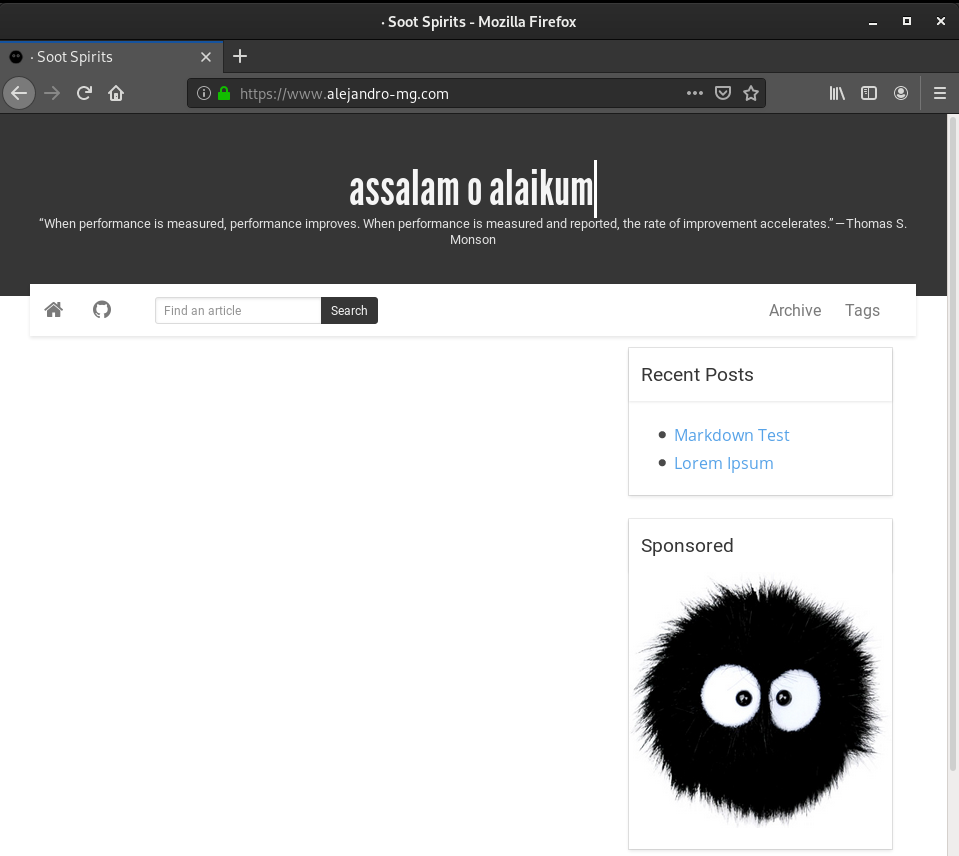

# Trabajando con GitHub Pages

Vamos a configurar GitHub Pages para subir una página estática a Internet, además le vamos a asignar un dominio propio.

Lo primero que tenemos que hacer es instalar el paquete de `git` en nuestro equipo, ya que es necesario para trabajar con GitHub Pages y poder realizar un Push al repositorio donde se alojara nuestra página.

###### Instalamos el paquete de `git`
~~~
sudo apt install git
~~~

El próximo punto que vamos a realizar es la creación de un repositorio en GitHub normal pero con algunas diferencias. Nuestra pagina se va a llamar `alejandro-mg`.

* Tenemos que llamar al repositorio conla extensión `.github.io`.
* No hace falta marcar la creacion del fichero `README`

###### Creamos el repositorio con el nombre `alejandro-mg.github.io`

Una vez creado el repositorio, nos dirigimos al directorio que tengamos nuestra página estática y ejecutamos los comandos que harán que se suban los ficheros de la página al repositorio creado

###### Subimos los ficheros
~~~
cd _site/
git init
git add .
git commit -m 'Creación del repo'
git remote add origin https://github.com/MoralG/alejandro-mg.github.io.git
git push -u origin master
~~~

Como podemos observar en la siguiente captura, tenenmos los ficheros alojados en el repositorio.

Ahora vamos a irnos a **Settings** en el repositorio, es decir a los ajustes del repositorio y en el apartado de **Options** hay una opcion de GitHub Pages, la cual vamos a activar selecionando el Source como **master branch**.

Hecho esto, ya tendremos nuestra página estática alojada en el hosting de GitHub Pages, y podremos acceder con la url que nos indica en el apartado de Options de GitGub Pages.

Pero esta dirección por defecto es bastante fea y si tenemos un dominio comprado, vamos a sacarle partido.

Lo primero que tenemos que hacer es introduccir nuestro dominio en el campo donde nos dice **Custom domain**

Ya tenemos configurado en GitHub Pages el dominio propio, pero tenemos que indicarle en nuestro proveedor de dominio un registro en el DNS de tipo ALIAS, para que cuando se acceda a través de internet a la dirección por defecto se redirija a nuestro domino.

Esperamos un tiempo, ya que GitHub Pages tarda un poco en configurar nuestro dominio y configurar el HTTPS, pero pasado ese tiempo tendremos nuestra página funcionando correctamente.

