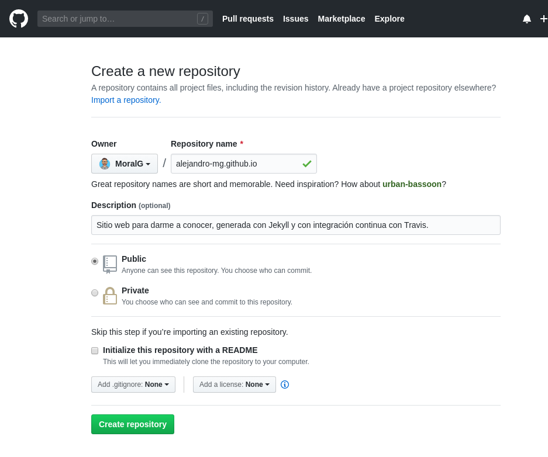
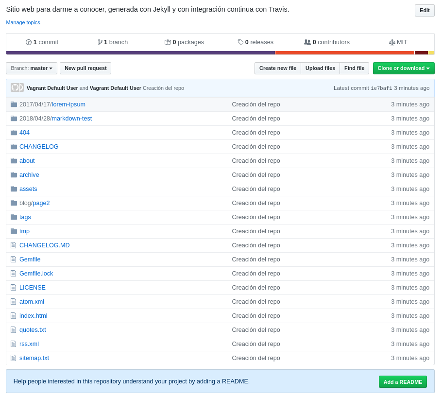
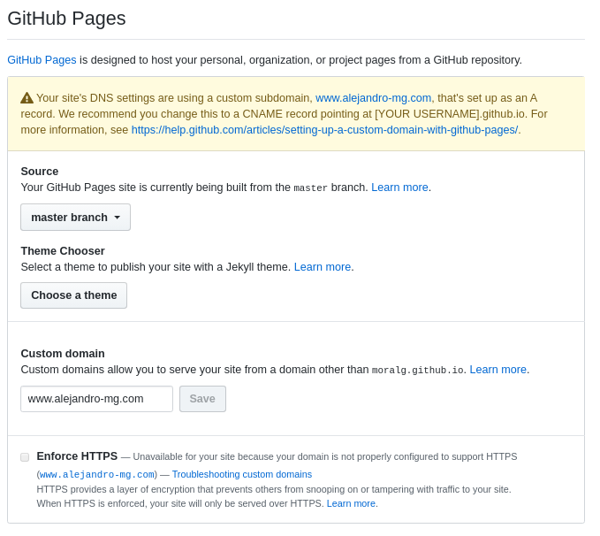
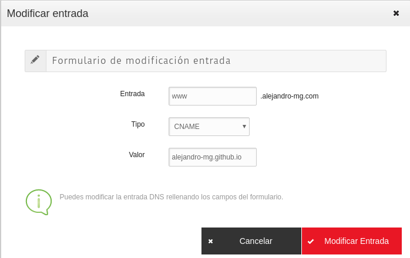
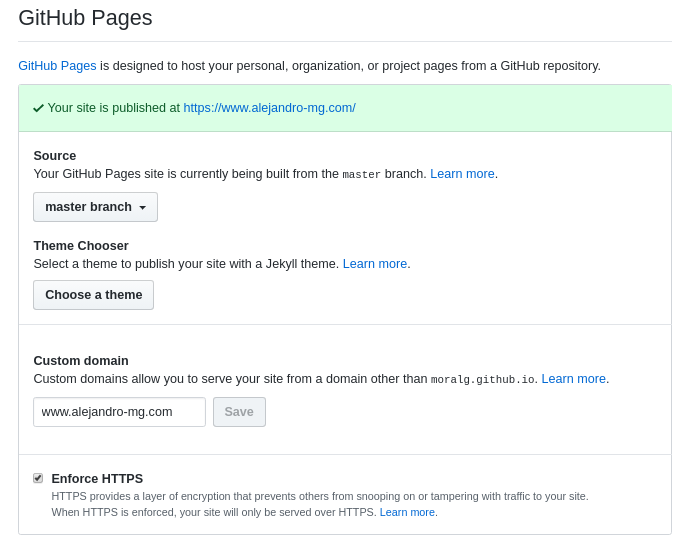

~~~
sudo apt install git
~~~

~~~
cd _site/
git init
git add .
git commit -m 'Creación del repo'
git remote add origin https://github.com/MoralG/alejandro-mg.github.io.git
git push -u origin master
~~~

217.116.0.144